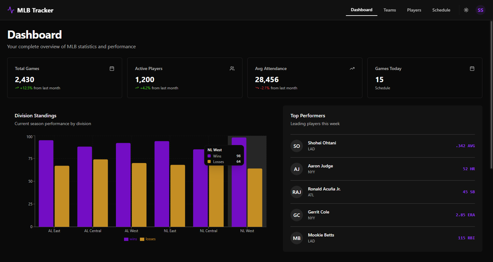
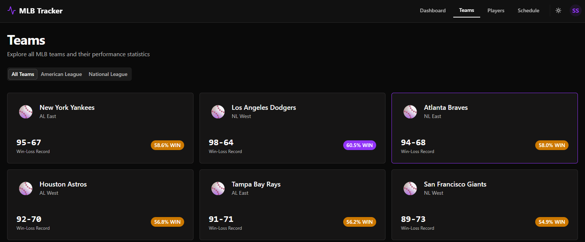
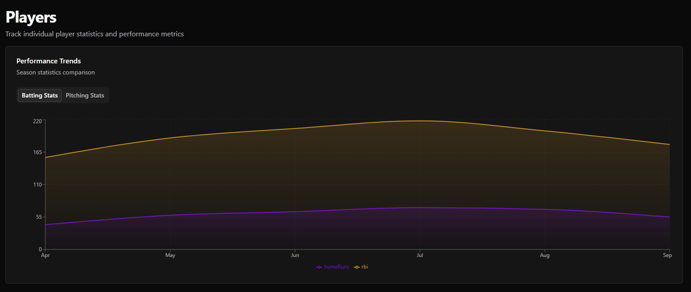
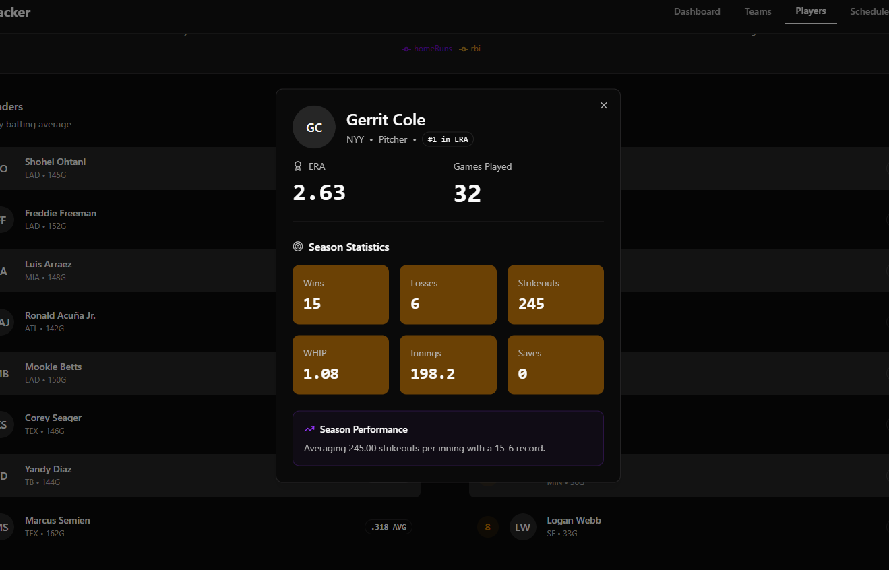
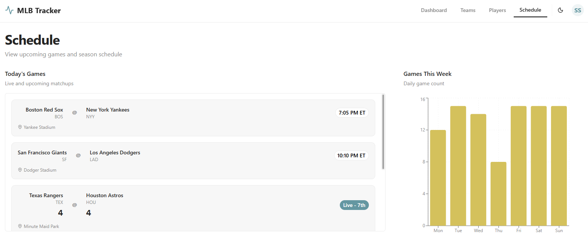
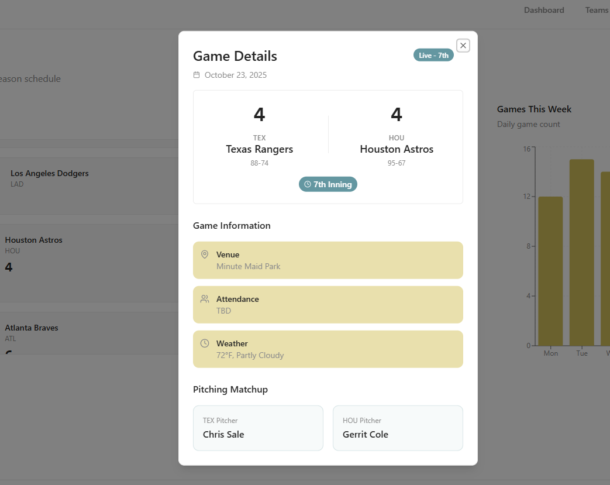

# ⚾ MLB Stats Tracker UI

A modern, data-driven web application UI for exploring Major League Baseball (MLB) team and player statistics, built with React, TypeScript, and Vite.

The interface provides real-time dashboards, team overviews, player performance insights, and schedule management — all styled with Tailwind CSS and Shadcn UI.

----

## 🧠 Overview

MLB Stats Tracker UI allows users to explore MLB data through a clean and responsive interface.
The app features dedicated pages for:

* Dashboard: Overview of division standings, top performers, and recent/upcoming games.
* Teams: Explore team stats, league performance, and division-level insights.
* Players: Compare player performance, track leaders, and visualize seasonal trends.
* Schedule: View daily games, weekly summaries, and full season calendars.

----

## 🧰 Tech Stack

**Frontend Framework:**

* ⚛️ React (with Vite for fast bundling)
* 🧩 TypeScript
* 🎨 Tailwind CSS
* 💎 Shadcn UI Components

**Routing:**
* React Router DOM

**State & Theming:**
* Context-based `ThemeProvider` for light/dark mode and theme persistence

----

## 🗂️ Project Structure
```graphql
src/
├── components/
│   ├── theme/                 # ThemeProvider and theme configuration
│   ├── navigation/            # App navigation bar and layout
│   ├── dashboard/             # Dashboard components and widgets
│   ├── teams/                 # Team grid, stats, and league tabs
│   ├── players/               # Player stats, leaderboards, and charts
│   ├── schedule/              # Game schedule, charts, and calendar
│   └── ui/                    # Shadcn UI wrappers (Cards, Tabs, etc.)
│
├── App.tsx                    # Main routing and layout structure
├── main.tsx                   # Application entry point
├── global.css                 # Tailwind base and custom global styles
└── index.html                 # Root HTML template
```

----
## 🚀 Getting Started

### 1️⃣ Clone the Repository
```bash
git clone https://github.com/sidneyshafer/mlb-stats-tracker-ui.git
cd mlb-stats-tracker-ui
```

### 2️⃣ Install Dependencies
```bash
npm install
# or
bun install
# or
yarn install
```

### 3️⃣ Start Development Server
```bash
npm run dev
```
Your app will be available at `http://localhost:5173`

### 4️⃣ Build for Production
```bash
npm run build
```

----

## 📸 Screenshots






